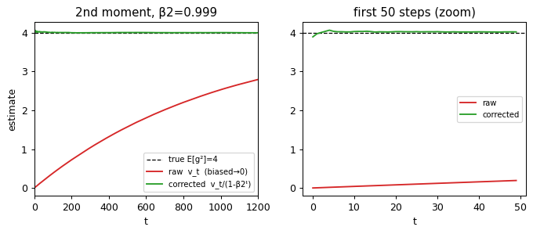
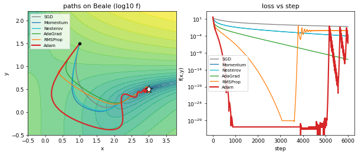
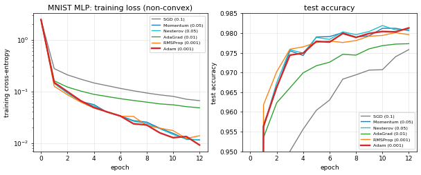
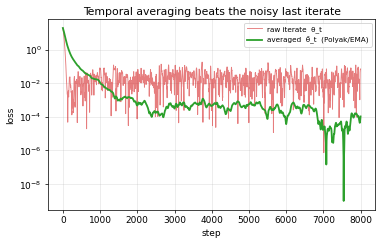

# Adam, from scratch

[](https://colab.research.google.com/github/Maverick-Ansh/adam-paper-implementation/blob/main/adam_from_scratch.ipynb)

A from-the-ground-up re-implementation and **experimental scrutiny** of the Adam optimizer, in plain Python + NumPy — no `torch.optim`, no `tf.keras.optimizers`. Every moving average, every bias-correction term, every `√v + ε` is written out by hand so you can watch what actually happens inside the loop.

> **Paper:** Kingma & Ba, *Adam: A Method for Stochastic Optimization*, ICLR 2015 — [arXiv:1412.6980](https://arxiv.org/abs/1412.6980)

The notebook doesn't just code Adam — for **every claim the paper makes**, it runs an experiment and checks the number.

## Contents

- [`adam_from_scratch.ipynb`](adam_from_scratch.ipynb) — the full annotated notebook (runs top-to-bottom on Google Colab or any Jupyter with NumPy + matplotlib; one experiment uses Keras only to download MNIST).
- `figs/` — all generated figures.

## What gets implemented

`SGD`, `Momentum`, `Nesterov`, `AdaGrad`, `RMSProp`, **`Adam`** (Algorithm 1) and **`AdaMax`** (Algorithm 2) — all sharing one `opt.step(params, grads)` interface, so every comparison is apples-to-apples. Logistic regression and a 2-layer MLP are trained with **hand-derived gradients / backprop** (no autograd).

## The scorecard — every paper claim, measured

| Claim (paper) | What we measured | Result |
|---|---|---|
| **Alg. 1** correctness | clear vs "efficient" update | identical to 9e-8 ✓ |
| **§3** bias correction recovers true moment | raw/truth = 1−β₂ᵗ exactly; corrected ≈ 1 from t=1 | ✓ (raw needs t≈2302 for 90%) |
| **§2.1** trust region \|Δt\| ⪅ α | tracked over 4000 steps | max = 1.000·α ✓ |
| **§6.4** no-bias-correction blows up early | first step = (1−β₁)/√(1−β₂) | 3.16× / 10× α as predicted ✓ |
| **§2.1** scale invariance | gradient ×10⁶ | trajectory diff ~1e-8 ✓ (SGD: 0.6 ✗) |
| **§2.1** SNR ⇒ auto-annealing | SNR over training | 0.66 → 0.088, constant lr ✓ |
| **§6.1** sparse gradients | synthetic BoW logistic | AdaGrad/Adam/RMSProp beat SGD ✓ |
| **§6.1** convex (MNIST LR) | training cost | Adam ≈ SGD+Nesterov > AdaGrad ✓ |
| **§6.2** non-convex (MLP) | training loss | Adam lowest (0.0091), fastest progress ✓ |
| **§7.1** AdaMax hard bound | \|Δt\| ≤ α | exactly 1.000·α ✓ |
| **§7.2** temporal averaging | averaged vs raw iterate | ~450× lower noise floor ✓ |

## Selected figures

**Initialization bias correction (§3)** — the raw EMA underestimates the true 2nd moment by exactly `1−β₂ᵗ`; dividing by that factor recovers the truth from step 1.



**Optimizer race on the Beale function** — adaptive methods carve through the curved valley; SGD stalls on the plateau.



**Non-convex: MLP on MNIST (backprop by hand)** — Adam reaches the lowest training loss fastest.



**Temporal averaging (§7.2)** — the averaged iterate sits ~450× below the noisy last iterate.



*(All eleven figures are in [`figs/`](figs/) and rendered inline in the notebook.)*

## The big picture

Adam = **momentum** (1st moment `m`) + **per-coordinate RMS scaling** (2nd moment `v`) + **an honest start** (bias correction). Those three pieces give it scale invariance, a built-in trust region, automatic annealing, and robustness to sparse/noisy gradients — which is why the defaults `α=0.001, β₁=0.9, β₂=0.999, ε=1e-8` "just work" across so many problems with almost no tuning.

## Run it

```bash
pip install -r requirements.txt
jupyter notebook adam_from_scratch.ipynb
```

Or open it directly in Colab (no install needed): [**adam_from_scratch.ipynb**](https://colab.research.google.com/github/Maverick-Ansh/adam-paper-implementation/blob/main/adam_from_scratch.ipynb).
